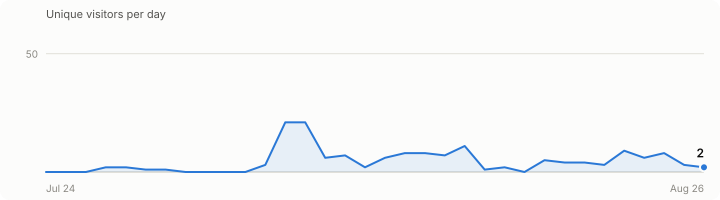

<h2 align="center">Human curiosity running on caffeine, code, and computational chaos.</h2>

I debug with coffee and defend with code. ☕

<!-- TRAFFIC:START -->
<h3 align="center">Reach</h3>

<b>109</b> unique visitors · <b>403</b> views · <b>233</b> unique cloners · <b>350</b> clones across 5 public repos 
Tracking since 2026-07-24 · last updated 2026-08-20

<picture>
<source media="(prefers-color-scheme: dark)" srcset=".github/assets/traffic-chart-dark.svg">
<source media="(prefers-color-scheme: light)" srcset=".github/assets/traffic-chart-light.svg">

</picture>

<b>Most visited:</b> <a href="https://github.com/code-saksham-hash/Resona"><b>Resona</b></a> (83 unique visitors, 285 views)

| Repo | Unique Visitors | Views | Unique Cloners | Clones |
|---|---|---|---|---|
| [Resona](https://github.com/code-saksham-hash/Resona) | 83 | 285 | 44 | 71 |
| [IPOPilot](https://github.com/code-saksham-hash/IPOPilot) | 12 | 52 | 32 | 40 |
| [timer_buddy](https://github.com/code-saksham-hash/timer_buddy) | 6 | 20 | 21 | 25 |

Repos need 5+ unique visitors to appear in the table above.

<!-- TRAFFIC:END -->

<h3 align="left">Languages and Tools</h3>

<h3 align="left">Achievements</h3>

Daily driver: <b>Arch Linux</b> not the flex, just tired of fighting an OS that fights back. 
Fuel of choice: <i>Dopio</i> on workdays, <i>Cortado</i>  when the week isn't trying to kill me.

<i>This account holds <b>personal & experimental projects only</b> freelance and client work lives elsewhere.</i> 
Portfolio → <a href="https://sakshambanjade.com"><b>sakshambanjade.com</b></a>

